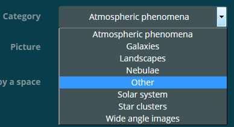

# Astronomy gallery

### April 28th 2017:

The project was part of the course "**Software technologies**" in **Software University Bulgaria**. It has been developed by 2 software development students with less than a year experience. The inspiration came from a website for astronomy pictures: <a href="http://www.emilivanov.com/index2.htm" target="_blank">http://www.emilivanov.com/index2.htm</a>. The rights to use the pictures for this project have been given by **Emil Ivanov** via **email** and the project will be presented to him too (_after the defense of the project on April 29th_). This project will **not be used** for any **commercial purposes** - it is a **non-profit** student **project**.

Due to the small experience of the developers when the project was created, it does not pretend to be perfect from software engineering point of view. However, many hours have been dedicated to it in order to work, look and feel good.

The beautiful **pictures** are separated **by categories**. They can be **searched** by tags or by categories.

## More details and features:

- **Hosting:** The application is temporarily hosted on **Microsoft Azure** - http://astrogallery.azurewebsites.net/
- **General look:** **Bootstrap Solar** theme is being **used** for the general look and style of the application(_2-3 elements of it have been slightly customized - e.g. color, padding_). The site is completely **responsive** on all types of screens(_tested on smartphone, laptop, TV_).
- **Authentication:** Users can **register** and **log in** to the site with **email** (username) and **password**
- **Seed at first startup:** Default administrator user account **"admin@astrogallery.net"**, roles **"Admin"** and **"User"** and category **"Other"** are being created in the database during the first start of the project 
- **Upload:** Pictures can be **uploaded** and **saved** in the project's **database** and **file system** (by a logged in user only)
- **Every picture is stored** in subdirectory with name the **name of its category** in ~/Content/images/astroPics/ (_e.g. /Content/images/astroPics/Galaxies_)
- **Download:** Pictures can be downloaded to a **user's device**
- **Categories:** Every uploaded picture is **put in a category**:

- **Edit:** Pictures **can be edited** (_title, description, category_) **by administrators** or **by the picture's uploader**:

- **Security:** Categories can be **created** and **edited/deleted** only by **administrators**:

- If a whole **category** is **deleted** then **all** of the **pictures** in that category are **deleted too**
- **Security:** All **post methods** and their respective **views** have **anti-forgery validation** tokens check; the **edition** and **deletion** of pictures is **allowed to authorized** users only who are **also** the **uploaders** of the pictures
- **Tags:** Every uploaded picture is required to have at **least one tag for** it:

- **Display modes:** The **pictures** can be displayed **by tags**, **by categories** and **individually**
- **Browsing:** When looking at a picture the user can go to the **next/previous** picture **in that category** (_if there is such_):

- **Browsing:** When looking at a picture the user **can go to the category of the picture** and see all pictures there
- **Browsing:** When looking at a picture the user **can see the user profile** of the picture's uploader

- **Rating system:** Every picture **can be rated by a user** - 1 to 5 stars:

- A user **can rate** a picture **only** once; an **uploader can't rate her/his own pictures**
- **Validations and notifications:** If an invalid data is entered by a user then a notification is shown saying what the error is. **"Bootstrap Notifications" NuGet package** is used for that feature.
- **Image validation:** Image file extension and content validation - when a **picture is being uploaded** (valid for profile picture too) **its content** (the file header) is being checked in order to be determined if it is really an image. That way even if a user **change the extension** of a **.txt** file for example to **.jpg** the application will reject the file and **won't store** it anywhere.

- **Default redirect** when a **non-existent URL** is entered - custom view for **ERROR 404** is showed allowing the user to go back to the home page:

- If an **unhandled exception** occurres a custom view **is showed allowing** the user to **go back** to the home page
- **Search:** Search feature for **categories** is included in the **navigation bar** 
- **Search:** Search feature for **categories** is included in the **administrator panel** 
- **Search:** Search feature for **users** is included in the **administrator panel**

- **Paging:** If the number of categories, pics, or users(in the admin panel) is higher than a certain value then they are being snowed on **more than** **one** **page**:

- **Slider/carousel:** On the index page of the project there is a slider showing a picture from **each possible category** (e.g. one planet, one galaxy, one nebulae, one star cluster etc.). The pictures in the slider are static and not taken from the currently uploaded pictures by the users because there can be category with no pictures in it:

- **User profiles:** Every user can **edit** her/his user profile – e.g. gender, city, country, birthday, profile picture:

- The **profile picture** of a user is **saved in a subdirectory** with name the **user's ID** in directory ~/Content/images/profilePics/ (e.g. /Content/images/profilePics/f1a6ddc2-156e-4dbe-8f28-3f5a62946562)

- The **birthday in the user profile** is being selected using **jquery** **date picker**:

	
- Every user **can hide/show** her/his **email** address **from her/his public user profile**:

- Every user **can view other users' profiles** and the **pictures** that they have **uploaded**
- **Administrator panel:** Users **in role "Admin"** have access to administrator panel **giving them** rights to **edit/delete** user **accounts** (make them administrators too) and **edit/delete** **categories**
- **If a user is deleted all of her/his pictures are deleted too**

